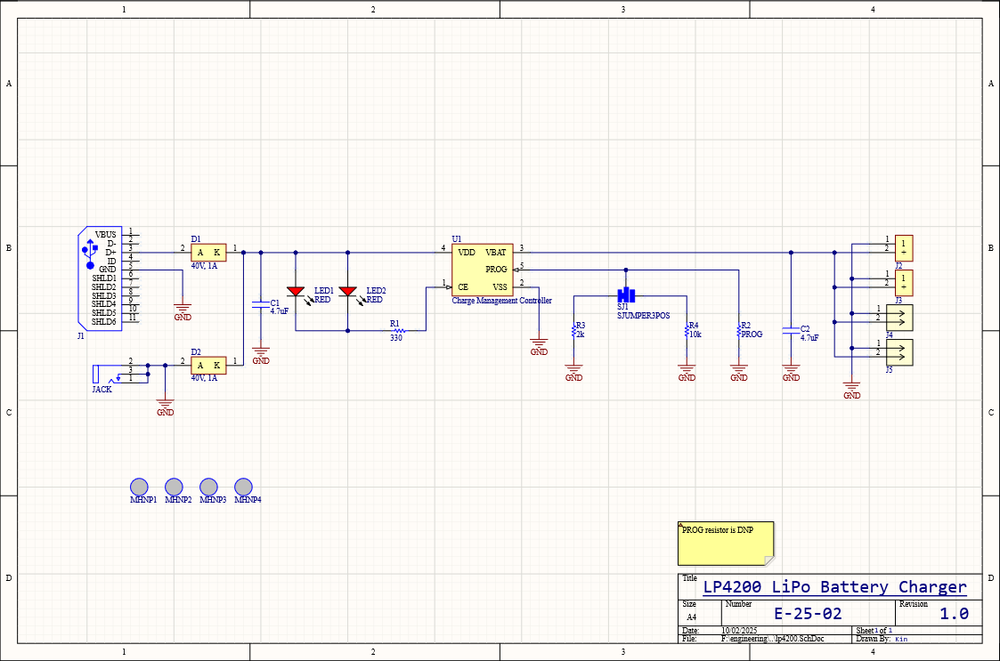
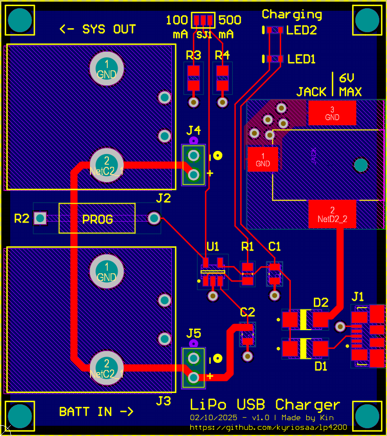
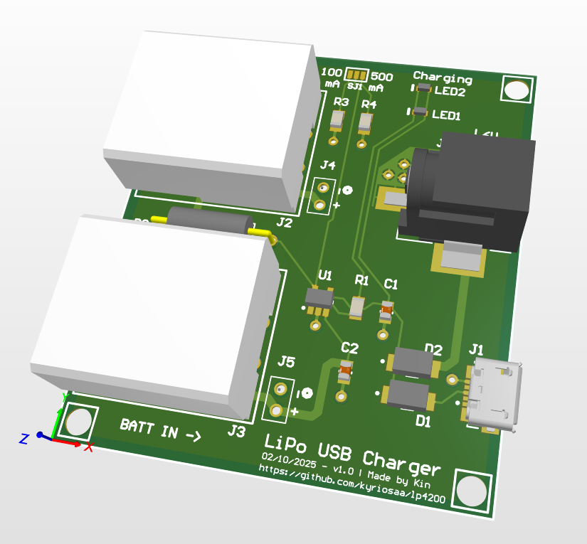
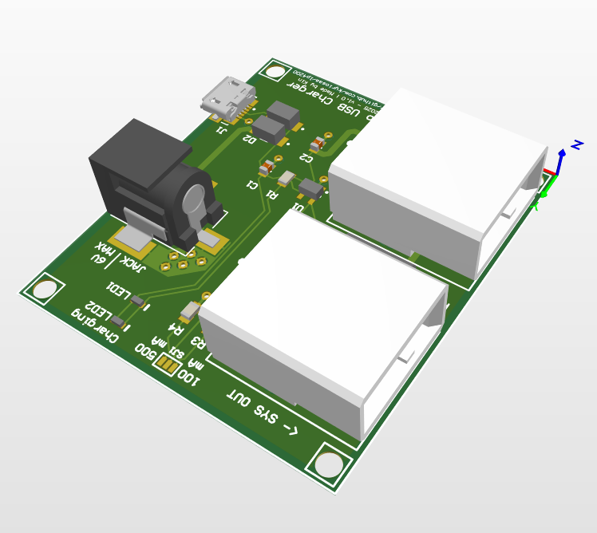
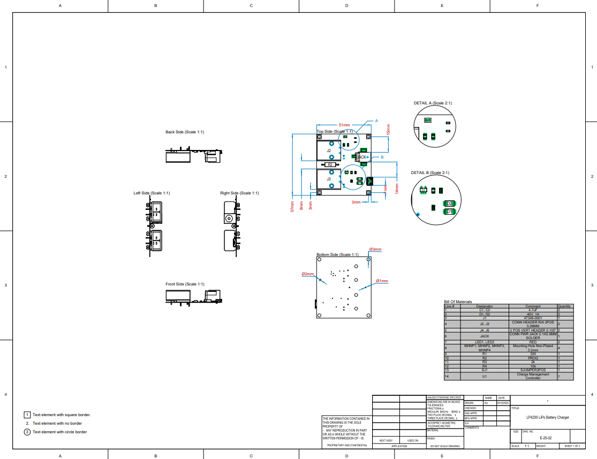
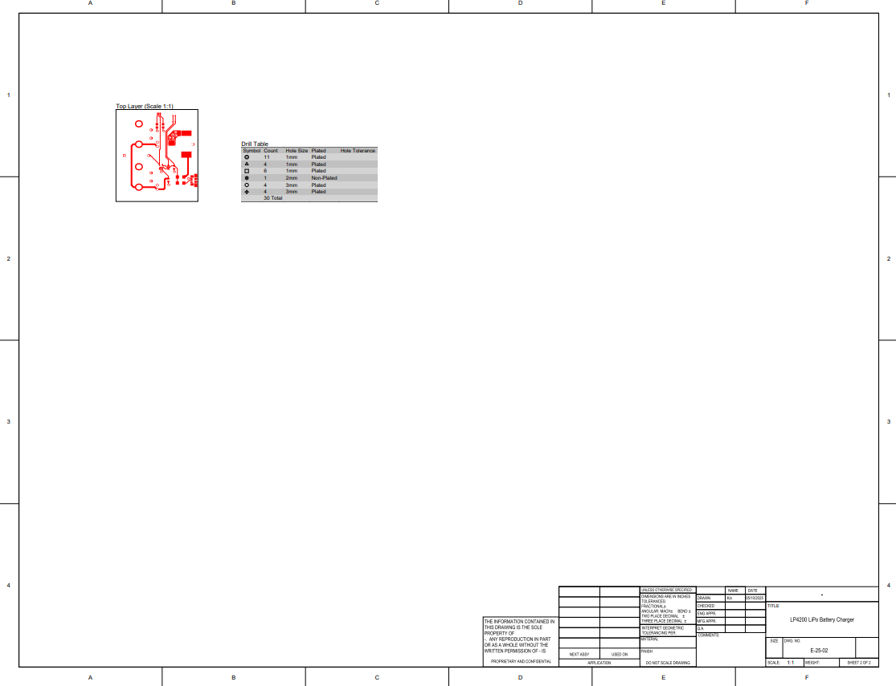

# LP4200 LiPo Battery Charging Board

[![Electronics](https://img.shields.io/badge/Electronics-B03931?style=flat&logo=data:image/svg+xml;base64,PCFET0NUWVBFIHN2ZyBQVUJMSUMgIi0vL1czQy8vRFREIFNWRyAxLjEvL0VOIiAiaHR0cDovL3d3dy53My5vcmcvR3JhcGhpY3MvU1ZHLzEuMS9EVEQvc3ZnMTEuZHRkIj4KDTwhLS0gVXBsb2FkZWQgdG86IFNWRyBSZXBvLCB3d3cuc3ZncmVwby5jb20sIFRyYW5zZm9ybWVkIGJ5OiBTVkcgUmVwbyBNaXhlciBUb29scyAtLT4KPHN2ZyB3aWR0aD0iODAwcHgiIGhlaWdodD0iODAwcHgiIHZpZXdCb3g9IjAgMCAyNCAyNCIgaWQ9IkxheWVyXzEiIGRhdGEtbmFtZT0iTGF5ZXIgMSIgeG1sbnM9Imh0dHA6Ly93d3cudzMub3JnLzIwMDAvc3ZnIiBmaWxsPSIjMDAwMEZGRkZGRiIgc3Ryb2tlPSIjMDAwMEZGRkZGRiI+Cg08ZyBpZD0iU1ZHUmVwb19iZ0NhcnJpZXIiIHN0cm9rZS13aWR0aD0iMCIvPgoNPGcgaWQ9IlNWR1JlcG9fdHJhY2VyQ2FycmllciIgc3Ryb2tlLWxpbmVjYXA9InJvdW5kIiBzdHJva2UtbGluZWpvaW49InJvdW5kIi8+Cg08ZyBpZD0iU1ZHUmVwb19pY29uQ2FycmllciI+Cg08ZGVmcz4KDTxzdHlsZT4uY2xzLTF7ZmlsbDpub25lO3N0cm9rZTojZmZmZmZmO3N0cm9rZS1taXRlcmxpbWl0OjEwO3N0cm9rZS13aWR0aDoxLjkycHg7fS5jbHMtMntmaWxsOiNmZmZmZmY7fTwvc3R5bGU+Cg08L2RlZnM+Cg08cmVjdCBjbGFzcz0iY2xzLTEiIHg9IjUuMjkiIHk9IjUuMjkiIHdpZHRoPSIxMy40MiIgaGVpZ2h0PSIxMy40MiIgcng9IjIuMjQiLz4KDTxsaW5lIGNsYXNzPSJjbHMtMSIgeDE9IjcuMjEiIHkxPSIwLjUiIHgyPSI3LjIxIiB5Mj0iNS4yOSIvPgoNPGxpbmUgY2xhc3M9ImNscy0xIiB4MT0iMTIiIHkxPSIwLjUiIHgyPSIxMiIgeTI9IjUuMjkiLz4KDTxsaW5lIGNsYXNzPSJjbHMtMSIgeDE9IjE2Ljc5IiB5MT0iMC41IiB4Mj0iMTYuNzkiIHkyPSI1LjI5Ii8+Cg08bGluZSBjbGFzcz0iY2xzLTEiIHgxPSI3LjIxIiB5MT0iMTguNzEiIHgyPSI3LjIxIiB5Mj0iMjMuNSIvPgoNPGxpbmUgY2xhc3M9ImNscy0xIiB4MT0iMTIiIHkxPSIxOC43MSIgeDI9IjEyIiB5Mj0iMjMuNSIvPgoNPGxpbmUgY2xhc3M9ImNscy0xIiB4MT0iMTYuNzkiIHkxPSIxOC43MSIgeDI9IjE2Ljc5IiB5Mj0iMjMuNSIvPgoNPGxpbmUgY2xhc3M9ImNscy0xIiB4MT0iMC41IiB5MT0iMTYuNzkiIHgyPSI1LjI5IiB5Mj0iMTYuNzkiLz4KDTxsaW5lIGNsYXNzPSJjbHMtMSIgeDE9IjAuNSIgeTE9IjEyIiB4Mj0iNS4yOSIgeTI9IjEyIi8+Cg08bGluZSBjbGFzcz0iY2xzLTEiIHgxPSIwLjUiIHkxPSI3LjIxIiB4Mj0iNS4yOSIgeTI9IjcuMjEiLz4KDTxsaW5lIGNsYXNzPSJjbHMtMSIgeDE9IjE4LjcxIiB5MT0iMTYuNzkiIHgyPSIyMy41IiB5Mj0iMTYuNzkiLz4KDTxsaW5lIGNsYXNzPSJjbHMtMSIgeDE9IjE4LjcxIiB5MT0iMTIiIHgyPSIyMy41IiB5Mj0iMTIiLz4KDTxsaW5lIGNsYXNzPSJjbHMtMSIgeDE9IjE4LjcxIiB5MT0iNy4yMSIgeDI9IjIzLjUiIHkyPSI3LjIxIi8+Cg08Y2lyY2xlIGNsYXNzPSJjbHMtMiIgY3g9IjE1LjgzIiBjeT0iOC4xNyIgcj0iMC45NiIvPgoNPC9nPgoNPC9zdmc+&logoColor=white)]()

A compact lithium polymer (LiPo) battery charging board with integrated safety features. For charging single-cell LiPo batteries used in IoT devices.

## Features

- **Single-cell LiPo charging** - Made for 3.7V lithium polymer batteries
- **Linear charging architecture** - Simple, reliable charging with minimal external components
- **Integrated safety features** - Over-current, over-voltage, and thermal protection
- **Compact form factor** - Space-efficient design for embedded applications
- **Status indication** - LED indicators for charging status
- **USB input** - Standard micro-USB or USB-C connector for power input

## Specifications

- **Input Voltage**: 5V ±5% (USB powered)
- **Charging Current**: Programmable via external resistor
- **Battery Voltage**: 3.7V nominal (4.2V max)
- **Charging Method**: Constant current / constant voltage (CC/CV)
- **Operating Temperature**: -40°C to +85°C
- **Board Dimensions**: 51 x 57 mm

## Images

Schematic

PCB Layout

3D Model

Assembly Drawing

