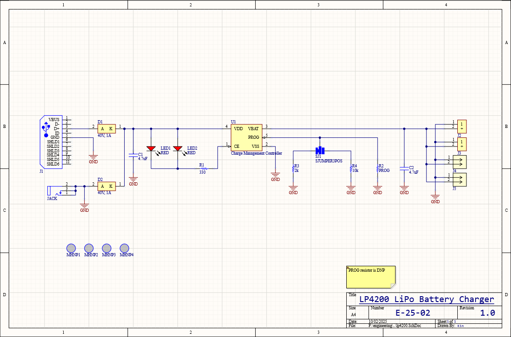
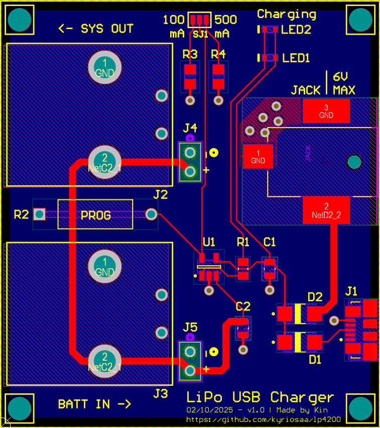
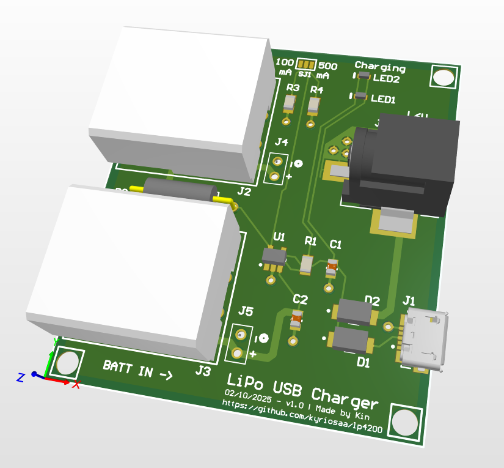
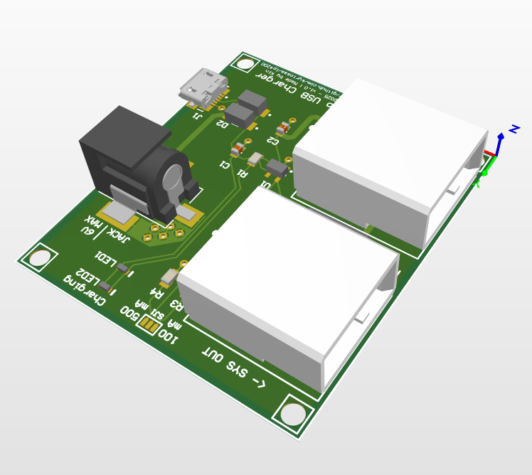
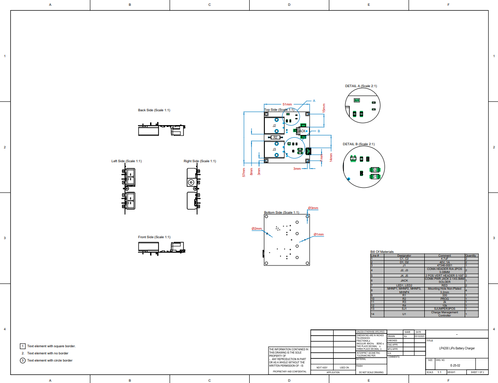
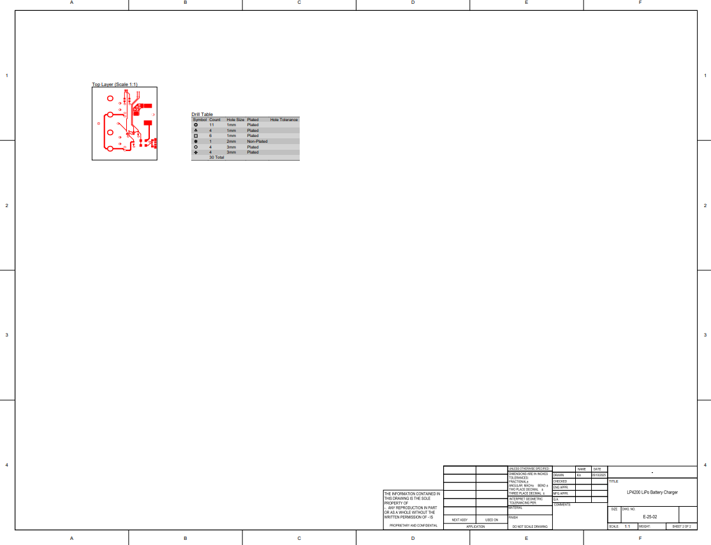

# LP4200 LiPo Battery Charging Board

[![Electronics](https://img.shields.io/badge/Electronics-B03931?style=flat&logo=&logoColor=white)]()

[![Altium](https://img.shields.io/badge/Altium_Designer-A5915F?style=flat&logo=%3D%3D)](https://www.altium.com/)

A compact lithium polymer (LiPo) battery charging board with integrated safety features. For charging single-cell LiPo batteries used in IoT devices.

## Features

- **Single-cell LiPo charging** - Made for 3.7V lithium polymer batteries
- **Linear charging architecture** - Simple, reliable charging with minimal external components
- **Integrated safety features** - Over-current, over-voltage, and thermal protection
- **Compact form factor** - Space-efficient design for embedded applications
- **Status indication** - LED indicators for charging status
- **USB input** - Standard micro-USB or USB-C connector for power input

## Specifications

- **Input Voltage** - 5V ±5% (USB powered)
- **Charging Current** - Programmable via external resistor
- **Battery Voltage** - 3.7V nominal (4.2V max)
- **Charging Method** - Constant current / constant voltage (CC/CV)
- **Operating Temperature** - -40°C to +85°C
- **Board Dimensions** - 51 x 57 mm

## Images

Schematic

PCB Layout

3D Model

Assembly Drawing

